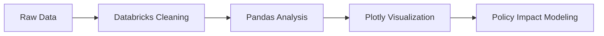

<h1 align="center">💧 38,000 Hospitalizations Exposing Northeastern Brazil's Sanitation Crisis</h1>
<h3 align="center">A National Geographic Freshwater Storytelling Proposal | SDG 6 Initiative</h3>

  
  
  

> *"In Maranhão, 59.09% of clean water vanishes in distribution - while 38,000 people get hospitalized annually from contaminated sources."*  

---
> Database 
> - [avaliable on hugging face](https://huggingface.co/datasets/carpenterbb/agua_e_esgoto_nordeste_brasileiro)

## Table of Contents
🔍 [Project Overview](#project-overview-book)  
📊 [Key Data Insights](#key-data-insights-bar_chart)  
🛠️ [Methodology & Tools](#methodology--tools-gear)  
🧑💻 [Developers](#developers-computer)  

---

## Project Overview :book:

**Objective**: Visualize the devastating link between water infrastructure gaps and public health outcomes across Northeastern Brazil's 9 states, supporting National Geographic's Freshwater Storytelling Initiative.

**Dataset Highlights**:
- 9 states analyzed
- 5 critical metrics per state
- IBGE official statistics
- DataSUS health data

---

## Key Data Insights :bar_chart:

### Critical Findings Table
| State | Water Coverage | Treated Sewage | Total Hospitalizations | Child Cases | Water Loss |
|-------|----------------|----------------|------------------------|-------------|------------|
| Bahia | 80.55% | 48.79% | 21,764 | 6,177 | 41.66% |
| Maranhão | 56.50% | 13.83% | **38,000** | 5,400 | **59.09%** |
| Piauí | 72.84% | 18.84% | 5,158 | 1,622 | 19.36% |

### Crisis Hotspots
1. **Maranhão's Dual Crisis**:  
   - Highest hospitalizations (38k)  
   - Worst water losses (59.09%)  
   - Lowest sewage treatment (13.83%)

2. **Sergipe's Child Emergency**:  
   - 35% of hospitalizations are children <10 yrs  
   - 91.62% water coverage ≠ 38.14% sewage treatment

---

## Methodology & Tools :gear:

### Workflow

### Tools Stack :gear:

| Purpose              | Tools                              |
|----------------------|------------------------------------|
| **Data Processing**  | Python 3.9, Pandas, PySpark       |
| **Visualization**    | Plotly, Matplotlib, Seaborn       |
| **Environment**      | Databricks Community Edition, Jupyter |

## Developers :octocat:

| [ Gabrielly Gomes](https://www.linkedin.com/in/gabrielly-gomes-ml/) |  [ Vinicius Calisto](https://www.linkedin.com/in/viniciuscalisto/) | 
 :---: | :---: |
